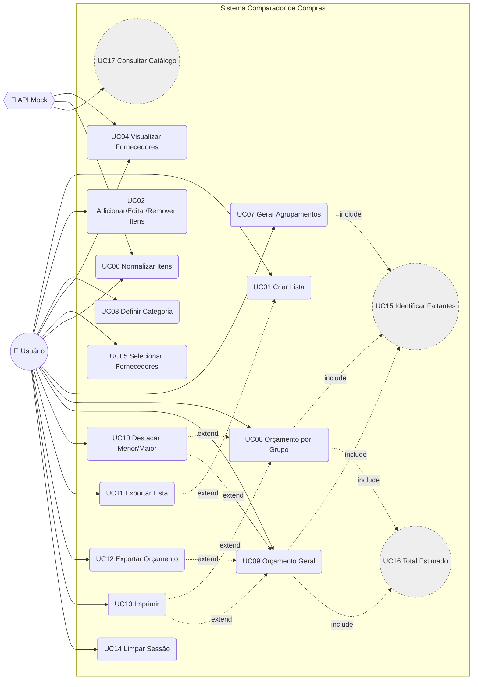

# Objetivo do projeto

Definir as necessidades fundamentais para o desenvolvimento de um sistema web-based que permita a qualquer usuário criar listas de compras genéricas — como supermercado, roupas, hardware, instrumentos, brinquedos etc. — e, a partir delas, comparar fornecedores simulados de acordo com uma categoria escolhida, com o objetivo de identificar o melhor preço total da lista.

O sistema deve lidar com situações em que nem todos os fornecedores possuem todos os itens solicitados, gerando agrupamentos de listas paralelas conforme a disponibilidade comum ou parcial dos itens. Também deve permitir orçamentos separados por grupo ou um orçamento geral, destacando itens faltantes, valores estimados, menor orçamento e, opcionalmente, maior orçamento.

A solução não deve reter dados do usuário, não deve exigir cadastro, deve operar com fornecedores mockados por meio de API REST alimentada por dados pré-populados em banco de dados e deve permitir exportação ou impressão das listas e orçamentos gerados.

Além disso, o projeto deve impor boas práticas de UI/UX, usabilidade, arquitetura de software, qualidade de código, privacidade, acessibilidade e testabilidade.

---

## 1. Contexto e problema

Ao planejar uma compra composta por vários itens, o usuário frequentemente precisa comparar preços em diferentes fornecedores. Porém:

- Nem sempre um único fornecedor possui todos os itens desejados.
- Alguns fornecedores têm preços melhores para certos itens, mas não atendem a lista inteira.
- Comparar manualmente listas grandes é trabalhoso e sujeito a erros.
- O usuário pode desejar saber:
  - Qual fornecedor tem o menor preço para os itens disponíveis.
  - Qual seria o custo estimado considerando itens faltantes em outros fornecedores.
  - Quais itens ficariam faltando em cada fornecedor.
  - Quais fornecedores possuem cobertura total ou parcial da lista.
  - Como dividir a lista em grupos de fornecedores com disponibilidade semelhante.

O sistema proposto resolve esse problema de forma simulada, sem integração real com fornecedores, usando um catálogo mockado em banco de dados para validar a lógica de comparação, agrupamento e orçamento.

---

## 2. Público-alvo

O sistema é destinado a usuários comuns que desejam planejar compras de forma rápida e comparativa, sem necessidade de autenticação ou persistência de dados pessoais.

Exemplos de uso:

- Comparar preços de supermercados.
- Comparar lojas de roupas.
- Comparar lojas de peças ou hardware.
- Comparar lojas de instrumentos musicais.
- Comparar lojas de brinquedos.
- Preparar uma lista impressa para conferência física durante a compra.

---

## 3. Escopo do projeto

### 3.1. Dentro do escopo

- Criação de listas de compras sem autenticação.
- Definição de itens com nome, quantidade, unidade e, quando possível, identificador normalizado.
- Seleção de categoria da lista.
- Seleção de fornecedores simulados compatíveis com a categoria.
- Comparação de disponibilidade de itens entre fornecedores mockados.
- Agrupamento de fornecedores por cobertura total ou parcial da lista.
- Geração de listas paralelas conforme itens comuns.
- Cálculo de orçamento por fornecedor.
- Cálculo de orçamento por grupo de fornecedores.
- Exibição de itens faltantes por fornecedor.
- Exibição de valores estimados para itens faltantes, quando houver referência em outro fornecedor.
- Destaque do menor orçamento.
- Opção de destacar o maior orçamento.
- Exportação de listas e orçamentos para arquivo imprimível.
- API REST mockada para fornecedores, produtos, categorias e simulação de orçamento.
- Banco de dados com dados pré-populados apenas para fins de simulação.
- Aplicação de boas práticas de UI/UX, acessibilidade, arquitetura, testes e privacidade.

### 3.2. Fora do escopo

- Cadastro de usuários.
- Login ou autenticação.
- Persistência de listas pessoais em servidor.
- Histórico de compras do usuário.
- Pagamentos reais.
- Integração real com fornecedores externos.
- Coleta de dados pessoais para marketing.
- Rastreamento individual do usuário.
- Recomendações personalizadas baseadas em perfil.
- Gestão de estoque real de fornecedores.
- Atualização automática de preços em fontes externas.

---

## 4. Premissas e restrições fundamentais

### 4.1. Premissas

- Os fornecedores são simulados e representam apenas dados de referência.
- O catálogo de produtos e preços é previamente populado em banco de dados.
- O usuário não precisa se identificar.
- A lista criada pelo usuário é efêmera e não deve ser armazenada no servidor.
- A comparação depende de itens normalizados ou mapeados para produtos conhecidos no catálogo mockado.
- O sistema pode funcionar com estado mantido apenas no navegador durante a sessão.
- A exportação local de arquivos pode ser usada como mecanismo de preservação opcional pelo usuário.

### 4.2. Restrições

- Nenhuma lista, orçamento ou entrada do usuário pode ser persistida em servidor.
- Não deve haver banco de dados com dados pessoais.
- Logs não devem conter dados que permitam identificar o usuário ou reconstruir listas pessoais.
- A API deve ser stateless em relação ao usuário.
- Qualquer rascunho salvo localmente no navegador deve ser opcional, transparente e removível pelo usuário.
- O sistema deve funcionar sem depender de serviços externos de terceiros para dados do usuário.

---

## 5. Requisitos funcionais fundamentais

| ID   | Requisito                        | Descrição                                                                                                                            | Prioridade |
| ---- | -------------------------------- | ------------------------------------------------------------------------------------------------------------------------------------ | ---------- |
| RF01 | Criar lista de compras           | O usuário deve poder criar uma lista com itens genéricos, sem cadastro.                                                              | MVP        |
| RF02 | Definir itens                    | Cada item deve possuir ao menos descrição e quantidade. Unidade de medida deve ser suportada.                                        | MVP        |
| RF03 | Editar lista                     | O usuário deve poder adicionar, remover, editar e reordenar itens.                                                                   | MVP        |
| RF04 | Selecionar categoria             | O usuário deve poder escolher uma categoria para a lista, como supermercado, roupas, hardware etc.                                   | MVP        |
| RF05 | Listar fornecedores mock         | O sistema deve listar fornecedores simulados compatíveis com a categoria escolhida.                                                  | MVP        |
| RF06 | Selecionar fornecedores          | O usuário deve poder escolher quais fornecedores participarão da comparação.                                                         | MVP        |
| RF07 | Normalizar itens                 | O sistema deve permitir associar itens da lista a produtos conhecidos no catálogo mockado quando possível.                           | MVP        |
| RF08 | Verificar disponibilidade        | O sistema deve verificar quais itens da lista existem em cada fornecedor selecionado.                                                | MVP        |
| RF09 | Agrupar fornecedores             | O sistema deve agrupar fornecedores conforme conjuntos de itens disponíveis.                                                         | MVP        |
| RF10 | Gerar listas paralelas           | O sistema deve gerar listas ou grupos decrementais conforme cobertura comum ou parcial dos itens.                                    | MVP        |
| RF11 | Orçamento por grupo              | O usuário deve poder visualizar orçamento separado por grupo de fornecedores.                                                        | MVP        |
| RF12 | Orçamento geral                  | O usuário deve poder visualizar orçamento geral considerando todos os fornecedores selecionados.                                     | MVP        |
| RF13 | Exibir itens faltantes           | Cada orçamento deve mostrar claramente os itens faltantes, quantidades e valor estimado quando aplicável.                            | MVP        |
| RF14 | Calcular total por fornecedor    | O sistema deve calcular o valor total disponível em cada fornecedor.                                                                 | MVP        |
| RF15 | Calcular total estimado completo | O sistema deve calcular um total estimado incluindo itens faltantes com base em fornecedores alternativos, quando houver referência. | MVP        |
| RF16 | Destacar menor orçamento         | O sistema deve destacar automaticamente o menor orçamento.                                                                           | MVP        |
| RF17 | Destacar maior orçamento         | O usuário deve poder inverter a lógica e destacar o maior orçamento.                                                                 | MVP        |
| RF18 | Exportar lista                   | O sistema deve permitir exportar a lista em arquivo imprimível.                                                                      | MVP        |
| RF19 | Exportar orçamento               | O sistema deve permitir exportar orçamento em arquivo imprimível.                                                                    | MVP        |
| RF20 | Impressão amigável               | O sistema deve possuir layout de impressão limpo, legível e sem elementos desnecessários.                                            | MVP        |
| RF21 | Não reter dados do usuário       | O backend não deve salvar listas, orçamentos ou dados pessoais.                                                                      | MVP        |
| RF22 | Recalcular automaticamente       | Alterações na lista, categoria ou fornecedores devem permitir novo cálculo.                                                          | MVP        |
| RF23 | Tratar itens não mapeados        | Itens não encontrados no catálogo devem ser sinalizados e não devem quebrar o fluxo.                                                 | MVP        |
| RF24 | Tratar itens ausentes            | Itens ausentes em todos os fornecedores devem ser exibidos como indisponíveis.                                                       | MVP        |
| RF25 | Exibir cobertura                 | O sistema deve mostrar percentual ou proporção de itens atendidos por fornecedor.                                                    | Alta       |
| RF26 | Comparar grupos                  | O usuário deve poder comparar visualmente grupos gerados.                                                                            | Alta       |
| RF27 | Alternar métrica de destaque     | O usuário deve poder alternar entre menor/maior total disponível ou total estimado completo.                                         | Alta       |
| RF28 | Importar lista exportada         | O usuário deve poder importar lista previamente exportada, se desejado.                                                              | Média      |
| RF29 | Rascunho local opcional          | O sistema pode permitir rascunho local no navegador, apenas com ação explícita do usuário.                                           | Média      |
| RF30 | Limpar sessão                    | O usuário deve poder limpar todos os dados da sessão local.                                                                          | Alta       |

---

## 6. Regras de negócio essenciais

### 6.1. Lista de compras

Uma lista de compras é composta por itens solicitados pelo usuário.

Cada item deve conter, no mínimo:

- Descrição.
- Quantidade.
- Unidade de medida, quando aplicável.
- Identificador de produto normalizado, quando disponível.
- Categoria associada, direta ou indiretamente.

Exemplo:

| Item | Descrição     | Quantidade | Unidade |
| ---- | ------------- | ---------: | ------- |
| 1    | Arroz 5kg     |          2 | unidade |
| 2    | Feijão 1kg    |          3 | unidade |
| 3    | Camiseta azul |          1 | unidade |

Para fins de comparação automática, o sistema deve tentar mapear cada item para um produto conhecido no catálogo mockado.

---

### 6.2. Categoria

A categoria define o contexto da comparação.

Exemplos:

- Supermercado.
- Roupas.
- Hardware.
- Instrumentos musicais.
- Brinquedos.
- Peças.

Somente fornecedores vinculados à categoria selecionada devem ser exibidos para comparação.

Caso a lista possua itens incompatíveis com a categoria selecionada, o sistema deve exibir aviso.

---

### 6.3. Fornecedores

Fornecedores são entidades simuladas cadastradas previamente no banco de dados.

Cada fornecedor deve possuir:

- Identificador.
- Nome.
- Categoria ou categorias atendidas.
- Situação ativa/inativa.
- Conjunto de produtos disponíveis.
- Preço por produto.
- Estoque simulado opcional.

Não há integração real com fornecedores externos.

---

### 6.4. Produtos

Produtos representam itens padronizados no catálogo mockado.

Cada produto deve possuir:

- Identificador.
- Nome.
- Categoria.
- Unidade de medida.
- Identificadores alternativos ou sinônimos, se necessário.
- Preços por fornecedor.
- Estoque por fornecedor, opcional.

A comparação de disponibilidade deve ocorrer preferencialmente por identificador normalizado de produto, não apenas por texto livre.

---

### 6.5. Disponibilidade de itens

Para cada fornecedor selecionado, o sistema deve calcular o conjunto de itens da lista que estão disponíveis.

Um item é considerado disponível quando:

- O fornecedor possui o produto correspondente em seu catálogo mockado.
- O produto possui preço válido.
- O produto está ativo.
- Caso haja controle de estoque simulado, há quantidade suficiente total ou parcialmente.

Caso o estoque seja menor que a quantidade solicitada, o sistema deve tratar como disponibilidade parcial.

Exemplo:

- Quantidade solicitada: 5.
- Estoque no fornecedor: 3.
- Situação: disponível parcialmente.
- Quantidade faltante: 2.

---

### 6.6. Itens faltantes

Um item é faltante para um fornecedor quando:

- O fornecedor não possui o produto.
- O produto está inativo.
- Não há preço válido.
- O estoque é insuficiente, caracterizando falta parcial.
- O item não pôde ser normalizado para o catálogo.

Para cada item faltante, o sistema deve exibir:

- Identificação do item.
- Quantidade solicitada.
- Quantidade faltante.
- Motivo da falta, quando possível.
- Valor unitário de referência, se houver outro fornecedor selecionado que possua o item.
- Valor total estimado da falta, quando aplicável.

---

### 6.7. Valor de referência para itens faltantes

Quando um item não estiver disponível em um fornecedor, mas estiver disponível em outro fornecedor selecionado, o sistema pode calcular um valor de referência.

Regra recomendada:

- O valor de referência deve ser o menor preço unitário disponível entre os fornecedores selecionados.
- O valor total estimado do item faltante deve ser:

```text
quantidade_faltante × menor_preço_unitário_disponível
```

Se nenhum fornecedor selecionado possuir o item:

- O item deve ser marcado como indisponível.
- O valor estimado deve ficar nulo ou zerado.
- O sistema deve exibir alerta de item não cotável.

---

## 7. Agrupamento de fornecedores e listas paralelas

### 7.1. Conceito

Quando a lista não é completamente atendida por todos os fornecedores selecionados, o sistema deve dividir a análise em grupos ou listas paralelas.

O agrupamento deve permitir visualizar:

- Quais fornecedores possuem exatamente os mesmos itens da lista.
- Quais fornecedores possuem coberturas parciais semelhantes.
- Quais itens são comuns a todos os fornecedores selecionados.
- Quais itens são comuns apenas a subconjuntos de fornecedores.
- Quais fornecedores possuem itens exclusivos ou ausência de itens.

---

### 7.2. Lista comum global

O sistema deve identificar os itens comuns a todos os fornecedores selecionados.

Exemplo:

Se os fornecedores selecionados possuem, em comum, os itens:

```text
1, 4, 5, 8, 9
```

Então a lista comum global é:

```text
Lista comum: 1, 4, 5, 8, 9
```

Essa lista comum pode ser exibida como um destaque inicial, mas não substitui necessariamente os grupos por cobertura.

---

### 7.3. Agrupamento por perfil de cobertura

A regra principal de agrupamento recomendada é:

> Fornecedores com exatamente o mesmo conjunto de itens disponíveis para a lista devem pertencer ao mesmo grupo.

Essa regra atende diretamente o exemplo apresentado.

Dado:

```text
Itens da lista: 1,2,3,4,5,6,7,8,9
Fornecedores: A,B,C,D,E,F,G,H
```

Com disponibilidade:

| Fornecedor | Itens disponíveis |
| ---------- | ----------------- |
| A          | 1,2,3,4,5,6,7,8,9 |
| B          | 1,2,3,4,5,6,7,8,9 |
| C          | 1,2,3,4,5,6,8,9   |
| D          | 1,2,4,5,8,9       |
| E          | 1,2,3,4,5,6,8,9   |
| F          | 1,2,3,4,5,6,8,9   |
| G          | 1,3,4,5,8,9       |
| H          | 1,2,3,4,5,6,8,9   |

O agrupamento esperado é:

### Lista I

Fornecedores com cobertura total da lista:

| Grupo   | Fornecedores | Itens disponíveis |
| ------- | ------------ | ----------------- |
| Lista I | A, B         | 1,2,3,4,5,6,7,8,9 |

### Lista II

Fornecedores com a mesma cobertura parcial:

| Grupo    | Fornecedores | Itens disponíveis |
| -------- | ------------ | ----------------- |
| Lista II | C, E, F, H   | 1,2,3,4,5,6,8,9   |

### Lista III

Fornecedor com cobertura própria:

| Grupo     | Fornecedores | Itens disponíveis |
| --------- | ------------ | ----------------- |
| Lista III | D            | 1,2,4,5,8,9       |

### Lista IV

Fornecedor com cobertura própria:

| Grupo    | Fornecedores | Itens disponíveis |
| -------- | ------------ | ----------------- |
| Lista IV | G            | 1,3,4,5,8,9       |

---

### 7.4. Algoritmo básico de agrupamento

Entrada:

```text
L = conjunto de itens da lista
S = conjunto de fornecedores selecionados
```

Processamento:

```text
para cada fornecedor s em S:
    A_s = conjunto de itens de L disponíveis em s

agrupar fornecedores cujo conjunto A_s seja idêntico

para cada grupo G:
    itens_comuns_do_grupo = A_s
    itens_faltantes_do_grupo = L - A_s
```

Ordenação recomendada dos grupos:

1. Maior quantidade de itens disponíveis.
2. Maior quantidade de fornecedores no grupo.
3. Menor quantidade de itens faltantes.
4. Ordem alfabética dos fornecedores, se necessário.

---

### 7.5. Estratégia decremental opcional

Além do agrupamento por perfil idêntico, o sistema pode oferecer uma visão decremental por interseção.

Exemplo:

1. Identificar itens presentes em 100% dos fornecedores selecionados.
2. Remover esses itens da análise residual.
3. Identificar itens presentes em subconjuntos de fornecedores.
4. Repetir até que todos os itens sejam classificados.

Essa abordagem é útil para responder:

- Quais itens todo mundo tem?
- Quais itens a maioria tem?
- Quais itens apenas alguns fornecedores têm?
- Quais itens nenhum fornecedor tem?

Para o MVP, o agrupamento por perfil de cobertura é suficiente e aderente ao exemplo apresentado.

---

## 8. Orçamento

### 8.1. Tipos de orçamento

O sistema deve suportar duas visões principais:

1. **Orçamento por grupo**
   - Exibe valores por grupo de fornecedores.
   - Útil quando a lista foi dividida em listas paralelas.
   - Permite comparar fornecedores dentro do mesmo perfil de cobertura.

2. **Orçamento geral**
   - Exibe todos os fornecedores selecionados em uma única visão consolidada.
   - Mantém destaque de itens faltantes.
   - Permite comparar o custo global entre todos os fornecedores.

---

### 8.2. Orçamento por fornecedor

Para cada fornecedor, o sistema deve calcular:

- Subtotal dos itens disponíveis.
- Subtotal estimado dos itens faltantes, quando houver referência.
- Total disponível.
- Total estimado completo.
- Quantidade de itens atendidos.
- Percentual de cobertura da lista.
- Quantidade de itens faltantes.
- Lista detalhada de itens faltantes.

Fórmulas recomendadas:

```text
total_disponível =
soma(preço_unitário × quantidade_atendida)
para itens disponíveis no fornecedor

total_estimado_faltantes =
soma(preço_unitário_de_referência × quantidade_faltante)
para itens faltantes com referência

total_estimado_completo =
total_disponível + total_estimado_faltantes
```

---

### 8.3. Exemplo de orçamento por fornecedor

Para um fornecedor com:

```text
Itens disponíveis: 1,2,3,4,5,6,8,9
Itens faltantes: 7
```

O orçamento deve mostrar:

| Campo                                | Valor           |
| ------------------------------------ | --------------- |
| Itens disponíveis                    | 1,2,3,4,5,6,8,9 |
| Itens faltantes                      | 7               |
| Quantidade faltante                  | 1               |
| Valor de referência do item faltante | R$ 10,00        |
| Total disponível                     | R$ 250,00       |
| Total estimado completo              | R$ 260,00       |

---

### 8.4. Critério de destaque

O sistema deve permitir destacar:

- Menor orçamento.
- Maior orçamento.

Métricas possíveis para destaque:

| Métrica                       | Descrição                                                          |
| ----------------------------- | ------------------------------------------------------------------ |
| Menor total disponível        | Considera apenas itens vendidos pelo próprio fornecedor.           |
| Maior total disponível        | Considera apenas itens vendidos pelo próprio fornecedor.           |
| Menor total estimado completo | Considera itens disponíveis mais referência para faltantes.        |
| Maior total estimado completo | Considera itens disponíveis mais referência para faltantes.        |
| Melhor cobertura              | Destaca quem atende mais itens, podendo usar preço como desempate. |

Recomendação para MVP:

- Padrão: destacar o **menor total estimado completo**.
- Alternativa: destacar o **menor total disponível**.
- Opção adicional: destacar o **maior orçamento**, conforme escolha do usuário.

O destaque deve sempre indicar claramente qual métrica está sendo usada.

---

### 8.5. Empates

Em caso de empate:

- Exibir todos os fornecedores empatados com o mesmo destaque.
- Indicar que há empate técnica.
- Permitir ordenação secundária por:
  - Maior cobertura.
  - Menor quantidade de itens faltantes.
  - Ordem alfabética.

---

## 9. Requisitos de UI/UX e usabilidade

### 9.1. Princípios gerais

A interface deve ser:

- Clara.
- Simples.
- Responsiva.
- Acessível.
- Transparente quanto ao cálculo.
- Tolerante a erros.
- Fácil de aprender.
- Adequada para uso em desktop e mobile.
- Preparada para impressão.

---

### 9.2. Fluxo recomendado

O fluxo principal pode ser organizado em etapas:

1. **Criar lista**
   - Adicionar itens.
   - Definir quantidades.
   - Definir categoria.

2. **Selecionar fornecedores**
   - Visualizar fornecedores mockados por categoria.
   - Selecionar fornecedores para comparação.

3. **Revisar mapeamento**
   - Confirmar itens reconhecidos.
   - Tratar itens não reconhecidos.
   - Ajustar quantidades.

4. **Visualizar grupos**
   - Ver listas paralelas.
   - Ver itens comuns.
   - Ver itens faltantes.

5. **Comparar orçamentos**
   - Ver orçamento por grupo.
   - Ver orçamento geral.
   - Alternar entre menor e maior destaque.

6. **Exportar ou imprimir**
   - Gerar arquivo imprimível.
   - Exportar lista ou orçamento.
   - Limpar sessão local.

---

### 9.3. Elementos essenciais da interface

A interface deve conter:

- Formulário simples para criação de lista.
- Tabela de itens com edição inline.
- Seletor de categoria.
- Lista de fornecedores com checkbox.
- Indicador de fornecedores selecionados.
- Painel de grupos/listas paralelas.
- Painel de orçamento.
- Cards de resumo:
  - Menor orçamento.
  - Maior orçamento.
  - Média de valores.
  - Cobertura máxima.
  - Quantidade de itens faltantes.
- Tabela detalhada por fornecedor.
- Lista de faltantes por fornecedor.
- Botões de exportação e impressão.
- Aviso claro de que os dados não são salvos no servidor.

---

### 9.4. Estados de interface

O sistema deve tratar:

- Lista vazia.
- Nenhum fornecedor selecionado.
- Fornecedores indisponíveis.
- Itens não mapeados.
- Itens não encontrados em nenhum fornecedor.
- Erro de comunicação com API.
- Orçamento em processamento.
- Orçamento concluído.
- Empates.
- Estoque insuficiente.
- Falha ao exportar.

---

### 9.5. Feedback ao usuário

O sistema deve fornecer feedback imediato para:

- Item adicionado.
- Item removido.
- Quantidade alterada.
- Fornecedor selecionado/removido.
- Cálculo iniciado.
- Cálculo concluído.
- Erro de validação.
- Exportação gerada.
- Dados limpos.

Mensagens devem ser:

- Objetivas.
- Visíveis.
- Não técnicas.
- Recuperáveis.
- Acompanhadas de ação corretiva quando possível.

---

### 9.6. Prevenção de erros

A interface deve:

- Evitar itens duplicados ou alertar sobre duplicidade.
- Validar quantidades maiores que zero.
- Impedir categorias vazias.
- Impedir comparação sem fornecedores selecionados.
- Avisar antes de limpar a sessão.
- Confirmar ações destrutivas.
- Permitir desfazer remoções recentes, quando viável.

---

### 9.7. Responsividade

A aplicação deve funcionar adequadamente em:

- Desktop.
- Tablet.
- Smartphone.

Em telas pequenas:

- Tabelas devem poder ser transformadas em cards ou listas expansíveis.
- Totais devem permanecer visíveis ou facilmente acessíveis.
- Botões principais devem ter tamanho adequado para toque.

---

### 9.8. Acessibilidade

O sistema deve seguir boas práticas de acessibilidade, incluindo:

- Navegação completa por teclado.
- Contraste adequado.
- Textos legíveis.
- Rótulos claros em campos de formulário.
- Uso correto de ARIA quando necessário.
- Foco visível.
- Mensagens de erro associadas aos campos.
- Não depender exclusivamente de cor para indicar status.
- Suporte a leitores de tela.
- Hierarquia semântica correta.

Referência recomendada:

- WCAG 2.1 nível AA como base.

---

### 9.9. Linguagem e clareza

O sistema deve usar linguagem simples em português.

Exemplos:

- “Itens que faltam neste fornecedor” em vez de “Itens ausentes no inventário”.
- “Melhor preço estimado” em vez de “Ótimo global ponderado”.
- “Nenhum fornecedor encontrado” em vez de “Erro 404 no recurso de fornecedores”.

---

## 10. Requisitos não funcionais

### 10.1. Privacidade e proteção de dados

| ID    | Requisito                    | Descrição                                                                                |
| ----- | ---------------------------- | ---------------------------------------------------------------------------------------- |
| RNF01 | Sem coleta de dados pessoais | O sistema não deve exigir nome, e-mail, CPF, telefone ou qualquer identificador pessoal. |
| RNF02 | Sem retenção de lista        | Listas enviadas para simulação não devem ser persistidas.                                |
| RNF03 | Logs anonimizados            | Logs devem conter apenas métricas técnicas e identificadores efêmeros não pessoais.      |
| RNF04 | Dados locais opcionais       | Qualquer armazenamento local deve ser opcional e controlado pelo usuário.                |
| RNF05 | Minimization                 | Apenas dados necessários para cálculo devem trafegar.                                    |
| RNF06 | Transparência                | O usuário deve ser informado de que os dados não são salvos no servidor.                 |

---

### 10.2. Segurança

| ID    | Requisito                     | Descrição                                                              |
| ----- | ----------------------------- | ---------------------------------------------------------------------- |
| RNF07 | HTTPS                         | Toda comunicação deve ocorrer via HTTPS.                               |
| RNF08 | Validação de entrada          | Toda entrada deve ser validada no frontend e backend.                  |
| RNF09 | Proteção contra XSS           | A interface deve escapar conteúdo dinâmico.                            |
| RNF10 | Proteção contra SQL Injection | Consultas devem usar parâmetros ou ORM seguro.                         |
| RNF11 | Cabeçalhos de segurança       | A aplicação deve usar cabeçalhos como CSP, X-Content-Type-Options etc. |
| RNF12 | Rate limiting                 | A API deve ter limite de requisições para evitar abuso.                |
| RNF13 | CORS restrito                 | A API deve aceitar apenas origens autorizadas.                         |
| RNF14 | Dependências auditadas        | Dependências devem ser verificadas contra vulnerabilidades conhecidas. |

---

### 10.3. Arquitetura e qualidade de código

| ID    | Requisito                      | Descrição                                                               |
| ----- | ------------------------------ | ----------------------------------------------------------------------- |
| RNF15 | Separação de responsabilidades | UI, lógica de domínio e acesso a dados devem ser separados.             |
| RNF16 | Arquitetura testável           | Regras de negócio devem ser isoladas e testáveis.                       |
| RNF17 | API stateless                  | A API não deve depender de sessão de usuário.                           |
| RNF18 | Código limpo                   | Código deve seguir padrões de nomenclatura e organização.               |
| RNF19 | Baixo acoplamento              | Módulos devem ter responsabilidades bem definidas.                      |
| RNF20 | Testes automatizados           | Projeto deve possuir testes unitários, de integração e E2E.             |
| RNF21 | Lint e formatação              | Deve haver padronização automática de código.                           |
| RNF22 | Documentação                   | Projeto deve possuir README, instruções de setup e documentação da API. |
| RNF23 | Versionamento                  | API deve ser versionada, por exemplo`/api/v1`.                          |
| RNF24 | Contrato de API                | API deve ser documentada com OpenAPI/Swagger.                           |

---

### 10.4. Performance

Metas recomendadas:

| Indicador            | Meta sugerida                                             |
| -------------------- | --------------------------------------------------------- |
| Carregamento inicial | Menor que 3 segundos em conexão intermediária             |
| Cálculo de orçamento | Menor que 2 segundos para até 100 itens e 50 fornecedores |
| API de fornecedores  | p95 menor que 500 ms                                      |
| Interface            | Interações sem travamentos perceptíveis                   |
| Impressão            | Layout gerado sem recalcular desnecessariamente           |

A aplicação deve evitar recálculos desnecessários e usar mecanismos como debounce para buscas ou edições intensas.

---

### 10.5. Confiabilidade

O sistema deve:

- Recuperar-se de falhas de API com mensagens claras.
- Permitir nova tentativa de cálculo.
- Não corromper a lista do usuário em caso de erro.
- Manter estado local consistente.
- Evitar perda acidental de dados durante a sessão.

---

### 10.6. Observabilidade

A aplicação deve possuir:

- Logs estruturados.
- Métricas de saúde.
- Endpoint de health check.
- Métricas de desempenho da API.
- Monitoramento de erros anonimizados.
- Rastreabilidade por request-id efêmero.

Nenhum log deve conter lista pessoal do usuário.

---

## 11. Arquitetura recomendada

### 11.1. Visão geral

A arquitetura recomendada é composta por:

```text
Frontend Web
   |
   | HTTPS / JSON
   v
API REST Mock
   |
   | Acesso a dados
   v
Banco de dados com dados mockados
```

O frontend é responsável por:

- Gerenciar a lista do usuário em memória.
- Permitir edição e visualização.
- Chamar a API para buscar categorias, fornecedores e simular orçamento.
- Exibir grupos, orçamentos e exportações.

A API é responsável por:

- Fornecer dados mockados de categorias, fornecedores e produtos.
- Calcular disponibilidade e orçamento com base em dados pré-populados.
- Não salvar dados do usuário.

O banco de dados é responsável por:

- Armazenar apenas dados de referência.
- Conter fornecedores, produtos, preços e estoque simulado.
- Servir como fonte para validar integração e lógica do sistema.

---

### 11.2. Componentes do frontend

Componentes sugeridos:

- Módulo de criação/edição de lista.
- Módulo de seleção de categoria.
- Módulo de seleção de fornecedores.
- Módulo de normalização/mapeamento de itens.
- Módulo de visualização de grupos.
- Módulo de orçamento.
- Módulo de exportação/impressão.
- Módulo de notificações e erros.
- Módulo de acessibilidade.

---

### 11.3. Componentes do backend

Serviços recomendados:

- CategoryService.
- SupplierService.
- ProductService.
- AvailabilityService.
- GroupingService.
- QuoteService.
- ReferencePriceService.
- ExportDataService, se a exportação for gerada no backend.

Recomendação importante:

- O GroupingService e o QuoteService devem conter lógica pura de domínio, independente de framework.

---

### 11.4. Backend stateless

A API deve operar sem sessão.

Exemplo:

```http
POST /api/v1/quotes/simulate
Content-Type: application/json

{
  "category": "supermercado",
  "items": [...],
  "suppliers": ["A", "B", "C"]
}
```

A resposta deve conter o resultado do cálculo, sem persistência.

---

## 12. Modelo de dados mockado

### 12.1. Entidades mínimas

#### categories

| Campo       | Tipo         | Descrição                  |
| ----------- | ------------ | -------------------------- |
| id          | uuid/integer | Identificador da categoria |
| name        | string       | Nome da categoria          |
| description | string       | Descrição opcional         |

#### suppliers

| Campo       | Tipo         | Descrição                   |
| ----------- | ------------ | --------------------------- |
| id          | uuid/integer | Identificador do fornecedor |
| name        | string       | Nome do fornecedor          |
| category_id | referência   | Categoria principal         |
| active      | boolean      | Situação do fornecedor      |

#### products

| Campo       | Tipo         | Descrição                |
| ----------- | ------------ | ------------------------ |
| id          | uuid/integer | Identificador do produto |
| name        | string       | Nome do produto          |
| category_id | referência   | Categoria                |
| unit        | string       | Unidade de medida        |
| active      | boolean      | Situação do produto      |

#### supplier_products

| Campo       | Tipo       | Descrição                  |
| ----------- | ---------- | -------------------------- |
| supplier_id | referência | Fornecedor                 |
| product_id  | referência | Produto                    |
| price       | decimal    | Preço unitário             |
| stock       | integer    | Estoque simulado           |
| active      | boolean    | Disponibilidade do vínculo |

---

### 12.2. Dados de seed obrigatórios

O banco deve conter dados mínimos para validar o cenário do projeto, incluindo:

- Pelo menos uma categoria.
- Pelo menos 8 fornecedores para o exemplo.
- Pelo menos 9 produtos para o exemplo.
- Preços diferentes entre fornecedores.
- Fornecedores com coberturas diferentes.
- Cenários com item ausente em todos.
- Cenários com estoque insuficiente.
- Cenários com produto inativo.

O exemplo dado deve ser incluído como caso de teste automatizado.

---

## 13. API REST mockada

### 13.1. Endpoints recomendados

#### Listar categorias

```http
GET /api/v1/categories
```

Resposta esperada:

```json
[
  {
    "id": "supermercado",
    "name": "Supermercado"
  },
  {
    "id": "roupas",
    "name": "Roupas"
  }
]
```

---

#### Listar fornecedores por categoria

```http
GET /api/v1/categories/{categoryId}/suppliers
```

Resposta esperada:

```json
[
  {
    "id": "A",
    "name": "Fornecedor A",
    "categoryId": "supermercado",
    "active": true
  }
]
```

---

#### Buscar produtos normalizados

```http
GET /api/v1/products/search?categoryId=supermercado&term=arroz
```

Resposta esperada:

```json
[
  {
    "id": "1",
    "name": "Arroz 5kg",
    "unit": "unidade"
  }
]
```

---

#### Simular orçamento

```http
POST /api/v1/quotes/simulate
```

Body:

```json
{
  "categoryId": "supermercado",
  "items": [
    {
      "productId": "1",
      "quantity": 2
    },
    {
      "productId": "2",
      "quantity": 3
    }
  ],
  "supplierIds": ["A", "B", "C"],
  "options": {
    "highlight": "lowest",
    "metric": "estimated_full_total"
  }
}
```

Resposta recomendada:

```json
{
  "meta": {
    "totalItems": 9,
    "selectedSuppliers": 8,
    "highlightMetric": "estimated_full_total",
    "highlightDirection": "lowest"
  },
  "commonItems": ["1", "4", "5", "8", "9"],
  "groups": [
    {
      "groupId": "I",
      "supplierIds": ["A", "B"],
      "availableItems": ["1", "2", "3", "4", "5", "6", "7", "8", "9"],
      "missingItems": []
    },
    {
      "groupId": "II",
      "supplierIds": ["C", "E", "F", "H"],
      "availableItems": ["1", "2", "3", "4", "5", "6", "8", "9"],
      "missingItems": ["7"]
    }
  ],
  "supplierQuotes": [
    {
      "supplierId": "A",
      "supplierName": "Fornecedor A",
      "availableTotal": 250.0,
      "missingReferenceTotal": 0.0,
      "estimatedFullTotal": 250.0,
      "coverage": {
        "totalItems": 9,
        "availableItems": 9,
        "missingItems": 0,
        "percentage": 100
      },
      "missingItems": []
    }
  ],
  "highlightedSupplierId": "A"
}
```

---

### 13.2. Requisitos da API

- Deve ser versionada.
- Deve documentar erros.
- Deve validar payloads.
- Deve retornar erros estruturados.
- Deve ser idempotente para simulação.
- Não deve gravar requisições de usuário.
- Deve suportar CORS para o frontend autorizado.
- Deve retornar códigos HTTP adequados.

---

### 13.3. Códigos HTTP recomendados

| Código | Uso                                             |
| ------ | ----------------------------------------------- |
| 200    | Sucesso                                         |
| 400    | Payload inválido                                |
| 404    | Categoria, fornecedor ou produto não encontrado |
| 422    | Regra de negócio inválida                       |
| 429    | Excesso de requisições                          |
| 500    | Erro interno                                    |
| 503    | Serviço indisponível                            |

---

## 14. Fluxos principais do usuário

### 14.1. Fluxo feliz

1. Usuário acessa o sistema.
2. Cria uma nova lista.
3. Adiciona itens.
4. Define categoria.
5. Seleciona fornecedores mockados.
6. Sistema normaliza itens.
7. Sistema calcula disponibilidade.
8. Sistema gera grupos de listas.
9. Sistema calcula orçamentos.
10. Usuário visualiza menor orçamento.
11. Usuário exporta ou imprime o resultado.

---

### 14.2. Fluxo com itens faltantes

1. Usuário cria lista com 9 itens.
2. Seleciona fornecedores A a H.
3. Sistema identifica que nem todos possuem todos os itens.
4. Sistema gera grupos I, II, III e IV.
5. Sistema mostra itens faltantes por fornecedor.
6. Sistema calcula total disponível.
7. Sistema calcula total estimado completo.
8. Usuário escolhe destacar menor ou maior orçamento.
9. Usuário exporta orçamento com pendências destacadas.

---

### 14.3. Fluxo com item não mapeado

1. Usuário adiciona item com descrição livre.
2. Sistema não encontra produto correspondente.
3. Sistema exibe aviso:
   - “Item não reconhecido no catálogo da categoria.”
4. Usuário pode:
   - Manter item como não cotável.
   - Escolher produto similar manualmente.
   - Remover item.
5. Orçamento é recalculado sem quebrar.

---

## 15. Exportação e impressão

### 15.1. Objetivo

O usuário deve poder gerar um arquivo para:

- Conferência no local da compra.
- Compartilhamento com terceiros.
- Registro pessoal temporário.
- Impressão física.

---

### 15.2. Formatos recomendados

| Formato           | Uso                                       |
| ----------------- | ----------------------------------------- |
| HTML imprimível   | Melhor opção para impressão formatada     |
| PDF via navegador | Geração de arquivo final para conferência |
| CSV               | Dados tabulares para análise              |
| JSON              | Estrutura completa para importação futura |

Para o MVP, recomenda-se:

- Botão “Imprimir” usando layout de impressão.
- Botão “Exportar CSV”.
- Botão “Exportar JSON” opcional.

---

### 15.3. Conteúdo da exportação de lista

A exportação da lista deve conter:

- Título da lista, se fornecido.
- Categoria.
- Data e hora da geração.
- Itens:
  - Descrição.
  - Quantidade.
  - Unidade.
  - Produto normalizado, se houver.

Não deve conter:

- Dados pessoais.
- Identificadores de sessão persistentes.
- Tokens.
- Cookies.

---

### 15.4. Conteúdo da exportação de orçamento

A exportação do orçamento deve conter:

- Categoria.
- Fornecedores selecionados.
- Grupos gerados.
- Itens comuns por grupo.
- Itens faltantes por fornecedor.
- Preço unitário.
- Quantidade solicitada.
- Quantidade atendida.
- Quantidade faltante.
- Total disponível.
- Total estimado completo.
- Fornecedor destacado.
- Métrica de destaque utilizada.
- Data e hora da geração.

---

### 15.5. Requisitos de impressão

A versão impressa deve:

- Remover menus e botões.
- Manter tabelas legíveis.
- Usar cores econômicas.
- Quebrar páginas de forma adequada.
- Destacar fornecedor escolhido.
- Mostrar itens faltantes claramente.
- Manter totais visíveis.
- Ser legível em papel A4.

---

## 16. Boas práticas de arquitetura

### 16.1. Arquitetura recomendada

Recomenda-se uma arquitetura em camadas ou hexagonal:

```text
UI
 |
Application / Use Cases
 |
Domain
 |
Infrastructure / Data
```

### 16.2. Separação de responsabilidades

- **UI**: interação, validação visual, estados.
- **Use Cases**: orquestração de regras de aplicação.
- **Domain**: regras de agrupamento, cálculo e orçamento.
- **Infrastructure**: acesso ao banco mockado e API.

---

### 16.3. Regras de negócio isoladas

As seguintes regras devem ser implementadas como módulos puros e testáveis:

- Cálculo de disponibilidade.
- Agrupamento por perfil de cobertura.
- Identificação de itens comuns.
- Identificação de itens faltantes.
- Cálculo de preço de referência.
- Cálculo de total disponível.
- Cálculo de total estimado completo.
- Destaque de menor/maior orçamento.

---

### 16.4. Padrões recomendados

- Repository para acesso a dados mockados.
- DTOs para entrada e saída da API.
- Mapper para transformação entre camadas.
- Use Cases para operações principais.
- Dependency Injection para desacoplamento.
- Validation objects para entrada de dados.

---

### 16.5. Boas práticas de código

- Nomes claros e semânticos.
- Funções pequenas.
- Módulos coesos.
- Evitar lógica de negócio em componentes de UI.
- Evitar duplicação.
- Usar tipos estáticos quando possível.
- Tratar erros de forma explícita.
- Manter código testável.
- Documentar decisões relevantes.

---

## 17. Estratégia de testes

### 17.1. Testes unitários

Devem cobrir:

- Agrupamento de fornecedores.
- Cálculo de itens comuns.
- Cálculo de itens faltantes.
- Cálculo de total disponível.
- Cálculo de total estimado.
- Escolha de menor/maior orçamento.
- Validações de entrada.
- Tratamento de estoque insuficiente.

---

### 17.2. Testes de integração

Devem cobrir:

- Consulta de categorias.
- Consulta de fornecedores por categoria.
- Consulta de produtos.
- Simulação de orçamento.
- Validação de payloads inválidos.
- Respostas de erro.
- Compatibilidade com contrato OpenAPI.

---

### 17.3. Testes end-to-end

Devem cobrir o fluxo principal:

1. Criar lista.
2. Selecionar categoria.
3. Selecionar fornecedores.
4. Visualizar grupos.
5. Visualizar orçamento.
6. Alternar destaque.
7. Exportar/imprimir.

---

### 17.4. Testes de acessibilidade

Devem verificar:

- Navegação por teclado.
- Contraste.
- Rótulos de formulário.
- Ordens de foco.
- Leitura por leitor de tela.
- Mensagens de erro acessíveis.

---

### 17.5. Testes de privacidade

Devem verificar:

- Que nenhuma lista é salva no servidor.
- Que logs não contêm dados do usuário.
- Que cookies não armazenam identificadores pessoais.
- Que exportações não incluem dados pessoais.

---

## 18. Critérios de aceite mínimos

### 18.1. Critério de aceite para criação de lista

Dado que o usuário acessa o sistema
Quando cria uma lista com itens e quantidades
Então os itens são exibidos corretamente
E nenhum dado é enviado para armazenamento permanente em servidor.

---

### 18.2. Critério de aceite para agrupamento

Dada a lista com itens 1 a 9E fornecedores A a H com as disponibilidades especificadasQuando o sistema calcular os gruposEntão deve gerar:

- Lista I com fornecedores A e B.
- Lista II com fornecedores C, E, F e H.
- Lista III com fornecedor D.
- Lista IV com fornecedor G.

---

### 18.3. Critério de aceite para orçamento

Dado um fornecedor com itens disponíveis e itens faltantesQuando o orçamento for calculadoEntão o sistema deve exibir:

- Total disponível.
- Itens faltantes.
- Quantidades faltantes.
- Valor estimado dos faltantes, quando houver referência.
- Total estimado completo.

---

### 18.4. Critério de aceite para destaque

Dado um conjunto de orçamentos calculados
Quando o usuário escolher destacar menor orçamento
Então o fornecedor com menor valor segundo a métrica escolhida deve ser destacado.

Quando o usuário escolher destacar maior orçamento
Então o fornecedor com maior valor segundo a métrica escolhida deve ser destacado.

---

### 18.5. Critério de aceite para exportação

Dado um orçamento visívelQuando o usuário solicitar exportação ou impressãoEntão o sistema deve gerar um documento contendo:

- Lista de itens.
- Fornecedores.
- Grupos.
- Valores.
- Itens faltantes.
- Total por fornecedor.
- Fornecedor destacado.
- Data e hora da geração.

---

### 18.6. Critério de aceite para privacidade

Dado qualquer fluxo do sistema
Quando o usuário enviar lista para cálculo
Então o backend não deve persistir a lista
E nenhum dado pessoal deve ser armazenado
E logs técnicos não devem permitir identificação do usuário.

---

## 19. Indicadores de qualidade do produto

### 19.1. Usabilidade

- Usuário consegue criar lista em menos de 2 minutos para casos simples.
- Usuário consegue entender grupos gerados sem documentação.
- Mensagens de erro indicam ação corretiva.
- Fluxo principal pode ser concluído sem cadastro.

### 19.2. Confiabilidade

- Cálculo não falha silenciosamente.
- Erros de API são tratados.
- Estado da interface permanece consistente.

### 19.3. Transparência

- Usuário entende por que um fornecedor foi destacado.
- Usuário vê itens faltantes claramente.
- Usuário sabe qual métrica está sendo usada.

### 19.4. Privacidade

- Nenhum dado pessoal é coletado.
- Nenhuma lista é salva em servidor.
- Usuário pode limpar dados locais facilmente.

---

## 20. Riscos e mitigação

| Risco                                         | Impacto                 | Mitigação                                                         |
| --------------------------------------------- | ----------------------- | ----------------------------------------------------------------- |
| Itens livres não correspondem ao catálogo     | Comparação incorreta    | Permitir mapeamento manual e sinalizar itens não cotáveis         |
| Preços faltantes                              | Orçamento incompleto    | Exibir item como indisponível e não calcular valor sem referência |
| Grupos complexos confundem usuário            | Baixa usabilidade       | Mostrar visão simples, grupos explicativos e tooltips             |
| Falta de retenção pode causar perda acidental | Insatisfação            | Permitir exportação e rascunho local opcional                     |
| API mockada não representa cenários reais     | Baixa validade do teste | Criar seed com casos extremos e testes automatizados              |
| Destaque de menor orçamento enganoso          | Decisão errada          | Mostrar métrica clara, faltantes e total estimado completo        |
| Acessibilidade negligenciada                  | Exclusão de usuários    | Incluir testes de teclado, contraste e leitores de tela           |
| Performance degradada com listas grandes      | Má experiência          | Limitar entradas, usar paginação virtual e debounce               |

---

## 21. Definição de pronto

Uma funcionalidade pode ser considerada pronta quando:

- Atender aos requisitos funcionais especificados.
- Possuir interface acessível e responsiva.
- Tratar estados de erro.
- Possuir testes automatizados.
- Não salvar dados do usuário em servidor.
- Estar documentada.
- Passar em revisão de código.
- Estar integrada à pipeline de CI.
- Possuir validação de entrada.
- Possuir mensagens claras em português.
- Funcionar em desktop e mobile.
- Permitir exportação ou impressão quando aplicável.

---

## 22. Entregáveis mínimos do MVP

O MVP deve entregar:

1. Interface web para criação de lista.
2. Seleção de categoria.
3. Seleção de fornecedores mockados.
4. API REST para dados mockados.
5. Banco de dados seed com fornecedores e produtos.
6. Motor de disponibilidade.
7. Motor de agrupamento por cobertura.
8. Motor de orçamento por fornecedor.
9. Exibição de itens faltantes.
10. Destaque de menor orçamento.
11. Opção de destacar maior orçamento.
12. Exportação imprimível.
13. Testes automatizados das regras principais.
14. Documentação de execução e API.
15. Garantia de não retenção de dados do usuário.

---

## 23. Glossário

| Termo                       | Descrição                                                     |
| --------------------------- | ------------------------------------------------------------- |
| Lista de compras            | Conjunto de itens definidos pelo usuário                      |
| Item                        | Produto ou necessidade inserida na lista                      |
| Fornecedor                  | Entidade simulada que vende produtos                          |
| Categoria                   | Contexto da lista, como supermercado ou roupas                |
| Disponibilidade             | Conjunto de itens da lista que um fornecedor possui           |
| Item comum                  | Item presente em todos os fornecedores de um grupo ou seleção |
| Item faltante               | Item não disponível em um fornecedor                          |
| Lista paralela              | Grupo de fornecedores com cobertura semelhante                |
| Orçamento                   | Cálculo de valores para uma lista em um ou mais fornecedores  |
| Orçamento estimado completo | Soma dos itens disponíveis com referência para faltantes      |
| Mock                        | Simulação de dados ou integrações reais                       |
| Seed                        | Dados iniciais inseridos em banco para teste                  |
| API REST                    | Interface de comunicação baseada em HTTP e JSON               |
| Exportação imprimível       | Arquivo ou layout preparado para impressão                    |

---

## 24. Resumo executivo

O sistema deve permitir que um usuário crie uma lista de compras sem cadastro, escolha uma categoria, selecione fornecedores simulados e compare preços. Quando nem todos os fornecedores possuírem todos os itens, o sistema deve agrupar fornecedores por cobertura comum ou parcial, gerar listas paralelas, evidenciar itens faltantes e calcular orçamentos individuais. O usuário deve poder visualizar o menor orçamento ou, opcionalmente, o maior orçamento, com métricas claras e transparentes. Todo o fluxo deve funcionar sem retenção de dados do usuário, com exportação imprimível, boas práticas de UI/UX, acessibilidade, arquitetura limpa, testes automatizados e API mockada baseada em dados pré-populados.

# Fases

## Fase 1 - Definição dos Casos de Uso e Diagrama de Casos de Uso

# Diagrama de Caso de Uso — MVP do Sistema Comparador de Compras

Abaixo apresento a modelagem criteriosa do diagrama de caso de uso, seguida do **script XML para Draw.io** (`.drawio`), que também pode ser importado em ferramentas como Miro (via _upload_ do arquivo) ou convertido para Mermaid/CSV.

---

## 1. Identificação dos Atores

| Ator                         | Tipo                 | Descrição                                                                                                                              |
| ---------------------------- | -------------------- | -------------------------------------------------------------------------------------------------------------------------------------- |
| **Usuário**                  | Primário (Humano)    | Qualquer pessoa que acessa o sistema para criar listas, comparar fornecedores e exportar orçamentos. Não há autenticação nem cadastro. |
| **API Mock de Fornecedores** | Secundário (Sistema) | Serviço REST simulado que provê catálogo de produtos, fornecedores mockados, preços e estoques pré-populados em banco de dados.        |

> ⚠️ **Observação:** Não há ator "Administrador" no MVP, pois o sistema não prevê gestão real de fornecedores, tampouco retenção de dados de usuário.

---

## 2. Casos de Uso do MVP

Os casos foram agrupados por fase do fluxo do usuário, respeitando as prioridades definidas no escopo.

### 2.1 Fase — Criação da Lista

| ID   | Caso de Uso                    | Descrição                                                    |
| ---- | ------------------------------ | ------------------------------------------------------------ |
| UC01 | Criar Lista de Compras         | Instanciar uma nova lista efêmera no navegador.              |
| UC02 | Adicionar/Editar/Remover Itens | Gerenciar itens, quantidades e unidades.                     |
| UC03 | Definir Categoria da Lista     | Selecionar categoria (supermercado, roupas, hardware, etc.). |

### 2.2 Fase — Seleção de Fornecedores

| ID   | Caso de Uso                             | Descrição                                                      |
| ---- | --------------------------------------- | -------------------------------------------------------------- |
| UC04 | Visualizar Fornecedores por Categoria   | Listar fornecedores mockados compatíveis com a categoria.      |
| UC05 | Selecionar Fornecedores para Comparação | Escolher subconjunto de fornecedores participantes.            |
| UC06 | Normalizar Itens ao Catálogo            | Mapear itens livres do usuário para produtos do catálogo mock. |

### 2.3 Fase — Análise e Comparação

| ID   | Caso de Uso                           | Descrição                                                           |
| ---- | ------------------------------------- | ------------------------------------------------------------------- |
| UC07 | Gerar Agrupamentos / Listas Paralelas | Agrupar fornecedores por cobertura comum/parcial.                   |
| UC08 | Visualizar Orçamento por Grupo        | Exibir orçamento segmentado por lista paralela.                     |
| UC09 | Visualizar Orçamento Geral            | Exibir orçamento consolidado de todos os fornecedores selecionados. |
| UC10 | Destacar Menor ou Maior Orçamento     | Alternar critério de destaque (regra opcional).                     |

### 2.4 Fase — Persistência Local e Exportação

| ID   | Caso de Uso              | Descrição                                        |
| ---- | ------------------------ | ------------------------------------------------ |
| UC11 | Exportar Lista           | Gerar arquivo (CSV/JSON) da lista criada.        |
| UC12 | Exportar Orçamento       | Gerar arquivo (CSV/JSON) do orçamento calculado. |
| UC13 | Imprimir Lista/Orçamento | Renderizar layout otimizado para impressão.      |
| UC14 | Limpar Sessão Local      | Apagar dados efêmeros da sessão no navegador.    |

---

## 3. Relações entre Casos de Uso

| Caso Base | Relação       | Caso Relacionado                      | Justificativa                                                |
| --------- | ------------- | ------------------------------------- | ------------------------------------------------------------ |
| UC07      | `<<include>>` | UC15 Identificar Itens Faltantes      | Agrupar requer saber quais itens faltam em cada fornecedor.  |
| UC08      | `<<include>>` | UC15 Identificar Itens Faltantes      | Orçamento por grupo depende da identificação de faltantes.   |
| UC09      | `<<include>>` | UC16 Calcular Total Estimado Completo | Orçamento geral exige cálculo com referência para faltantes. |
| UC09      | `<<include>>` | UC15 Identificar Itens Faltantes      | Orçamento geral requer identificação de faltantes.           |
| UC10      | `<<extend>>`  | UC08 / UC09                           | Destaque é opcional sobre qualquer visão de orçamento.       |
| UC13      | `<<extend>>`  | UC08 / UC09                           | Impressão é ação opcional sobre orçamento visualizado.       |
| UC11      | `<<extend>>`  | UC01                                  | Exportação da lista ocorre após sua criação.                 |
| UC12      | `<<extend>>`  | UC09                                  | Exportação do orçamento ocorre após visualização.            |

### Casos de Uso Internos (auxiliares)

| ID   | Caso de Uso                      | Descrição                                                                              |
| ---- | -------------------------------- | -------------------------------------------------------------------------------------- |
| UC15 | Identificar Itens Faltantes      | Detectar itens indisponíveis, parcialmente disponíveis ou não cotáveis por fornecedor. |
| UC16 | Calcular Total Estimado Completo | Somar itens disponíveis + valor de referência dos faltantes.                           |
| UC17 | Consultar Catálogo Mock          | Requisição à API Mock para obter produtos/fornecedores.                                |

---

## 4. Script de Exportação — Draw.io (`.drawio`)

> **Como usar:** salve o conteúdo abaixo em um arquivo `use-case-diagram.drawio` e abra diretamente em [app.diagrams.net](https://app.diagrams.net) ou importe em Miro via upload do arquivo (ou use _Miro Assist → Import .drawio_).

```xml
<mxfile host="app.diagrams.net" modified="2026-08-15T00:00:00.000Z" agent="MVP Comparador de Compras" version="24.0.0" type="device">
  <diagram id="mvp-use-case" name="Caso de Uso - MVP">
    <mxGraphModel dx="1800" dy="1200" grid="1" gridSize="10" guides="1" tooltips="1" connect="1" arrows="1" fold="1" page="1" pageScale="1" pageWidth="1800" pageHeight="1200" math="0" shadow="0">
      <root>
        <mxCell id="0"/>
        <mxCell id="1" parent="0"/>

        <!-- BOUNDARY DO SISTEMA -->
        <mxCell id="boundary" value="Sistema Comparador de Compras (MVP)" style="swimlane;startSize=30;fillColor=#E6F3FF;strokeColor=#0050B3;fontStyle=1;fontSize=16;rounded=1;arcSize=5;" vertex="1" parent="1">
          <mxGeometry x="360" y="80" width="1100" height="1040" as="geometry"/>
        </mxCell>

        <!-- ATOR USUÁRIO -->
        <mxCell id="actorUser" value="Usuário" style="shape=umlActor;verticalLabelPosition=bottom;verticalAlign=top;html=1;outlineConnect=0;fontSize=14;fontStyle=1;fillColor=#FFF2CC;strokeColor=#D6B656;" vertex="1" parent="1">
          <mxGeometry x="120" y="540" width="40" height="80" as="geometry"/>
        </mxCell>

        <!-- ATOR API MOCK -->
        <mxCell id="actorAPI" value="API Mock de
Fornecedores" style="shape=umlActor;verticalLabelPosition=bottom;verticalAlign=top;html=1;outlineConnect=0;fontSize=13;fontStyle=1;fillColor=#D5E8D4;strokeColor=#82B366;" vertex="1" parent="1">
          <mxGeometry x="1600" y="540" width="40" height="80" as="geometry"/>
        </mxCell>

        <!-- ==================== FASE 1: CRIAÇÃO ==================== -->
        <mxCell id="group1" value="Fase 1 — Criação da Lista" style="text;html=1;strokeColor=none;fillColor=none;align=left;verticalAlign=middle;whiteSpace=wrap;rounded=0;fontStyle=2;fontSize=11;fontColor=#0050B3;" vertex="1" parent="1">
          <mxGeometry x="390" y="130" width="200" height="20" as="geometry"/>
        </mxCell>

        <mxCell id="UC01" value="UC01 — Criar Lista de Compras" style="ellipse;whiteSpace=wrap;html=1;fillColor=#FFF2CC;strokeColor=#D6B656;fontSize=12;" vertex="1" parent="boundary">
          <mxGeometry x="60" y="160" width="260" height="60" as="geometry"/>
        </mxCell>
        <mxCell id="UC02" value="UC02 — Adicionar/Editar/Remover Itens" style="ellipse;whiteSpace=wrap;html=1;fillColor=#FFF2CC;strokeColor=#D6B656;fontSize=12;" vertex="1" parent="boundary">
          <mxGeometry x="60" y="240" width="260" height="60" as="geometry"/>
        </mxCell>
        <mxCell id="UC03" value="UC03 — Definir Categoria da Lista" style="ellipse;whiteSpace=wrap;html=1;fillColor=#FFF2CC;strokeColor=#D6B656;fontSize=12;" vertex="1" parent="boundary">
          <mxGeometry x="60" y="320" width="260" height="60" as="geometry"/>
        </mxCell>

        <!-- ==================== FASE 2: SELEÇÃO ==================== -->
        <mxCell id="group2" value="Fase 2 — Seleção de Fornecedores" style="text;html=1;strokeColor=none;fillColor=none;align=left;verticalAlign=middle;whiteSpace=wrap;rounded=0;fontStyle=2;fontSize=11;fontColor=#0050B3;" vertex="1" parent="1">
          <mxGeometry x="390" y="420" width="220" height="20" as="geometry"/>
        </mxCell>

        <mxCell id="UC04" value="UC04 — Visualizar Fornecedores por Categoria" style="ellipse;whiteSpace=wrap;html=1;fillColor=#DAE8FC;strokeColor=#6C8EBF;fontSize=12;" vertex="1" parent="boundary">
          <mxGeometry x="60" y="450" width="260" height="60" as="geometry"/>
        </mxCell>
        <mxCell id="UC05" value="UC05 — Selecionar Fornecedores para Comparação" style="ellipse;whiteSpace=wrap;html=1;fillColor=#DAE8FC;strokeColor=#6C8EBF;fontSize=12;" vertex="1" parent="boundary">
          <mxGeometry x="60" y="530" width="260" height="60" as="geometry"/>
        </mxCell>
        <mxCell id="UC06" value="UC06 — Normalizar Itens ao Catálogo" style="ellipse;whiteSpace=wrap;html=1;fillColor=#DAE8FC;strokeColor=#6C8EBF;fontSize=12;" vertex="1" parent="boundary">
          <mxGeometry x="60" y="610" width="260" height="60" as="geometry"/>
        </mxCell>

        <!-- ==================== FASE 3: ANÁLISE ==================== -->
        <mxCell id="group3" value="Fase 3 — Análise e Comparação" style="text;html=1;strokeColor=none;fillColor=none;align=left;verticalAlign=middle;whiteSpace=wrap;rounded=0;fontStyle=2;fontSize=11;fontColor=#0050B3;" vertex="1" parent="1">
          <mxGeometry x="820" y="130" width="220" height="20" as="geometry"/>
        </mxCell>

        <mxCell id="UC07" value="UC07 — Gerar Agrupamentos / Listas Paralelas" style="ellipse;whiteSpace=wrap;html=1;fillColor=#F8CECC;strokeColor=#B85450;fontSize=12;" vertex="1" parent="boundary">
          <mxGeometry x="480" y="160" width="260" height="60" as="geometry"/>
        </mxCell>
        <mxCell id="UC08" value="UC08 — Visualizar Orçamento por Grupo" style="ellipse;whiteSpace=wrap;html=1;fillColor=#F8CECC;strokeColor=#B85450;fontSize=12;" vertex="1" parent="boundary">
          <mxGeometry x="480" y="240" width="260" height="60" as="geometry"/>
        </mxCell>
        <mxCell id="UC09" value="UC09 — Visualizar Orçamento Geral" style="ellipse;whiteSpace=wrap;html=1;fillColor=#F8CECC;strokeColor=#B85450;fontSize=12;" vertex="1" parent="boundary">
          <mxGeometry x="480" y="320" width="260" height="60" as="geometry"/>
        </mxCell>
        <mxCell id="UC10" value="UC10 — Destacar Menor ou Maior Orçamento" style="ellipse;whiteSpace=wrap;html=1;fillColor=#F8CECC;strokeColor=#B85450;fontSize=12;" vertex="1" parent="boundary">
          <mxGeometry x="480" y="400" width="260" height="60" as="geometry"/>
        </mxCell>

        <!-- ==================== FASE 4: EXPORTAÇÃO ==================== -->
        <mxCell id="group4" value="Fase 4 — Exportação e Sessão" style="text;html=1;strokeColor=none;fillColor=none;align=left;verticalAlign=middle;whiteSpace=wrap;rounded=0;fontStyle=2;fontSize=11;fontColor=#0050B3;" vertex="1" parent="1">
          <mxGeometry x="820" y="490" width="220" height="20" as="geometry"/>
        </mxCell>

        <mxCell id="UC11" value="UC11 — Exportar Lista" style="ellipse;whiteSpace=wrap;html=1;fillColor=#E1D5E7;strokeColor=#9673A6;fontSize=12;" vertex="1" parent="boundary">
          <mxGeometry x="480" y="520" width="260" height="60" as="geometry"/>
        </mxCell>
        <mxCell id="UC12" value="UC12 — Exportar Orçamento" style="ellipse;whiteSpace=wrap;html=1;fillColor=#E1D5E7;strokeColor=#9673A6;fontSize=12;" vertex="1" parent="boundary">
          <mxGeometry x="480" y="600" width="260" height="60" as="geometry"/>
        </mxCell>
        <mxCell id="UC13" value="UC13 — Imprimir Lista/Orçamento" style="ellipse;whiteSpace=wrap;html=1;fillColor=#E1D5E7;strokeColor=#9673A6;fontSize=12;" vertex="1" parent="boundary">
          <mxGeometry x="480" y="680" width="260" height="60" as="geometry"/>
        </mxCell>
        <mxCell id="UC14" value="UC14 — Limpar Sessão Local" style="ellipse;whiteSpace=wrap;html=1;fillColor=#E1D5E7;strokeColor=#9673A6;fontSize=12;" vertex="1" parent="boundary">
          <mxGeometry x="480" y="760" width="260" height="60" as="geometry"/>
        </mxCell>

        <!-- ==================== CASOS INTERNOS ==================== -->
        <mxCell id="group5" value="Casos Internos (auxiliares)" style="text;html=1;strokeColor=none;fillColor=none;align=left;verticalAlign=middle;whiteSpace=wrap;rounded=0;fontStyle=2;fontSize=11;fontColor=#0050B3;" vertex="1" parent="1">
          <mxGeometry x="820" y="820" width="220" height="20" as="geometry"/>
        </mxCell>

        <mxCell id="UC15" value="UC15 — Identificar Itens Faltantes" style="ellipse;whiteSpace=wrap;html=1;fillColor=#F5F5F5;strokeColor=#666666;fontColor=#333333;fontSize=12;dashed=1;" vertex="1" parent="boundary">
          <mxGeometry x="480" y="850" width="260" height="60" as="geometry"/>
        </mxCell>
        <mxCell id="UC16" value="UC16 — Calcular Total Estimado Completo" style="ellipse;whiteSpace=wrap;html=1;fillColor=#F5F5F5;strokeColor=#666666;fontColor=#333333;fontSize=12;dashed=1;" vertex="1" parent="boundary">
          <mxGeometry x="480" y="930" width="260" height="60" as="geometry"/>
        </mxCell>
        <mxCell id="UC17" value="UC17 — Consultar Catálogo Mock" style="ellipse;whiteSpace=wrap;html=1;fillColor=#F5F5F5;strokeColor=#666666;fontColor=#333333;fontSize=12;dashed=1;" vertex="1" parent="boundary">
          <mxGeometry x="480" y="1010" width="260" height="60" as="geometry"/>
        </mxCell>

        <!-- ==================== ASSOCIAÇÕES USUÁRIO ==================== -->
        <mxCell id="a1" style="endArrow=none;html=1;strokeColor=#0050B3;" edge="1" source="actorUser" target="UC01" parent="1"/>
        <mxCell id="a2" style="endArrow=none;html=1;strokeColor=#0050B3;" edge="1" source="actorUser" target="UC02" parent="1"/>
        <mxCell id="a3" style="endArrow=none;html=1;strokeColor=#0050B3;" edge="1" source="actorUser" target="UC03" parent="1"/>
        <mxCell id="a4" style="endArrow=none;html=1;strokeColor=#0050B3;" edge="1" source="actorUser" target="UC04" parent="1"/>
        <mxCell id="a5" style="endArrow=none;html=1;strokeColor=#0050B3;" edge="1" source="actorUser" target="UC05" parent="1"/>
        <mxCell id="a6" style="endArrow=none;html=1;strokeColor=#0050B3;" edge="1" source="actorUser" target="UC06" parent="1"/>
        <mxCell id="a7" style="endArrow=none;html=1;strokeColor=#0050B3;" edge="1" source="actorUser" target="UC07" parent="1"/>
        <mxCell id="a8" style="endArrow=none;html=1;strokeColor=#0050B3;" edge="1" source="actorUser" target="UC08" parent="1"/>
        <mxCell id="a9" style="endArrow=none;html=1;strokeColor=#0050B3;" edge="1" source="actorUser" target="UC09" parent="1"/>
        <mxCell id="a10" style="endArrow=none;html=1;strokeColor=#0050B3;" edge="1" source="actorUser" target="UC10" parent="1"/>
        <mxCell id="a11" style="endArrow=none;html=1;strokeColor=#0050B3;" edge="1" source="actorUser" target="UC11" parent="1"/>
        <mxCell id="a12" style="endArrow=none;html=1;strokeColor=#0050B3;" edge="1" source="actorUser" target="UC12" parent="1"/>
        <mxCell id="a13" style="endArrow=none;html=1;strokeColor=#0050B3;" edge="1" source="actorUser" target="UC13" parent="1"/>
        <mxCell id="a14" style="endArrow=none;html=1;strokeColor=#0050B3;" edge="1" source="actorUser" target="UC14" parent="1"/>

        <!-- ==================== ASSOCIAÇÕES API MOCK ==================== -->
        <mxCell id="b1" style="endArrow=none;html=1;strokeColor=#82B366;" edge="1" source="actorAPI" target="UC04" parent="1"/>
        <mxCell id="b2" style="endArrow=none;html=1;strokeColor=#82B366;" edge="1" source="actorAPI" target="UC06" parent="1"/>
        <mxCell id="b3" style="endArrow=none;html=1;strokeColor=#82B366;" edge="1" source="actorAPI" target="UC17" parent="1"/>

        <!-- ==================== <<include>> ==================== -->
        <mxCell id="inc1" style="endArrow=open;endSize=12;dashed=1;html=1;strokeColor=#B85450;fontSize=10;" value="<<include>>" edge="1" source="UC07" target="UC15" parent="1">
          <mxGeometry relative="1" as="geometry"/>
        </mxCell>
        <mxCell id="inc2" style="endArrow=open;endSize=12;dashed=1;html=1;strokeColor=#B85450;fontSize=10;" value="<<include>>" edge="1" source="UC08" target="UC15" parent="1">
          <mxGeometry relative="1" as="geometry"/>
        </mxCell>
        <mxCell id="inc3" style="endArrow=open;endSize=12;dashed=1;html=1;strokeColor=#B85450;fontSize=10;" value="<<include>>" edge="1" source="UC09" target="UC15" parent="1">
          <mxGeometry relative="1" as="geometry"/>
        </mxCell>
        <mxCell id="inc4" style="endArrow=open;endSize=12;dashed=1;html=1;strokeColor=#B85450;fontSize=10;" value="<<include>>" edge="1" source="UC09" target="UC16" parent="1">
          <mxGeometry relative="1" as="geometry"/>
        </mxCell>
        <mxCell id="inc5" style="endArrow=open;endSize=12;dashed=1;html=1;strokeColor=#B85450;fontSize=10;" value="<<include>>" edge="1" source="UC08" target="UC16" parent="1">
          <mxGeometry relative="1" as="geometry"/>
        </mxCell>

        <!-- ==================== <<extend>> ==================== -->
        <mxCell id="ext1" style="endArrow=open;endSize=12;dashed=1;html=1;strokeColor=#9673A6;fontSize=10;" value="<<extend>>" edge="1" source="UC10" target="UC08" parent="1">
          <mxGeometry relative="1" as="geometry"/>
        </mxCell>
        <mxCell id="ext2" style="endArrow=open;endSize=12;dashed=1;html=1;strokeColor=#9673A6;fontSize=10;" value="<<extend>>" edge="1" source="UC10" target="UC09" parent="1">
          <mxGeometry relative="1" as="geometry"/>
        </mxCell>
        <mxCell id="ext3" style="endArrow=open;endSize=12;dashed=1;html=1;strokeColor=#9673A6;fontSize=10;" value="<<extend>>" edge="1" source="UC13" target="UC08" parent="1">
          <mxGeometry relative="1" as="geometry"/>
        </mxCell>
        <mxCell id="ext4" style="endArrow=open;endSize=12;dashed=1;html=1;strokeColor=#9673A6;fontSize=10;" value="<<extend>>" edge="1" source="UC13" target="UC09" parent="1">
          <mxGeometry relative="1" as="geometry"/>
        </mxCell>
        <mxCell id="ext5" style="endArrow=open;endSize=12;dashed=1;html=1;strokeColor=#9673A6;fontSize=10;" value="<<extend>>" edge="1" source="UC11" target="UC01" parent="1">
          <mxGeometry relative="1" as="geometry"/>
        </mxCell>
        <mxCell id="ext6" style="endArrow=open;endSize=12;dashed=1;html=1;strokeColor=#9673A6;fontSize=10;" value="<<extend>>" edge="1" source="UC12" target="UC09" parent="1">
          <mxGeometry relative="1" as="geometry"/>
        </mxCell>

        <!-- ==================== LEGENDA ==================== -->
        <mxCell id="legend" value="<b>Legenda</b><br>—— Associação Ator↔Caso<br>- - → <<include>> (vermelho)<br>- - → <<extend>> (roxo)<br>⋯⋯ Caso Interno (tracejado)" style="rounded=1;whiteSpace=wrap;html=1;fillColor=#FAFAFA;strokeColor=#CCCCCC;align=left;spacingLeft=10;fontSize=11;" vertex="1" parent="1">
          <mxGeometry x="60" y="860" width="240" height="120" as="geometry"/>
        </mxCell>
      </root>
    </mxGraphModel>
  </diagram>
</mxfile>
```

---

## 5. Alternativa — Formato Mermaid (Miro / Markdown)

Se desejar embutir diretamente em READMEs, docs do GitHub/GitLab ou no Miro via plugin Mermaid, use o script abaixo:



---

## 6. Instruções de Importação

### Para **Draw.io / diagrams.net**

1. Acesse [app.diagrams.net](https://app.diagrams.net).
2. Vá em **File → Open from → Device** e selecione o arquivo `use-case-diagram.drawio`.
3. Alternativamente: **File → Import from → Device**.

### Para **Miro**

**Opção A — Via .drawio:**

1. No Miro, abra um quadro.
2. Clique em **⋯ (More apps) → Search → "Draw.io"** (ou instale o app Draw.io).
3. Use **Import .drawio file** e selecione o arquivo gerado.

**Opção B — Via Mermaid:**

1. Instale o app **"Mermaid Diagrams"** dentro do Miro.
2. Cole o bloco Mermaid acima em um novo diagrama.

**Opção C — PNG/SVG:**

1. Abra o `.drawio` no Draw.io.
2. Exporte como **SVG** ou **PNG** via **File → Export as**.
3. Arraste o arquivo para o quadro do Miro.

### Para **GitHub/GitLab**

- Use o bloco Mermaid diretamente no `README.md` (ambas as plataformas renderizam nativamente).

---

## 7. Critérios de Qualidade Aplicados

| Critério                           | Como foi atendido                                                                                                                            |
| ---------------------------------- | -------------------------------------------------------------------------------------------------------------------------------------------- |
| **Aderência ao MVP**               | Apenas casos priorizados como "MVP" e "Alta" foram modelados. Funcionalidades fora do escopo (login, pagamentos, histórico) foram excluídas. |
| **Privacidade**                    | Nenhum caso prevê autenticação, cadastro ou persistência server-side.                                                                        |
| **Separação de responsabilidades** | Casos internos (UC15–UC17) abstraem lógica de domínio pura, alinhando-se à arquitetura recomendada.                                          |
| **Independência de tecnologia**    | O diagrama é agnóstico: serve igualmente para Frontend JS/Python, API Python/Go, MySQL/PostgreSQL.                                           |
| **Coesão de ator**                 | API Mock aparece apenas em casos de leitura de catálogo, refletindo corretamente seu papel passivo.                                          |
| **Testabilidade**                  | Casos internos isolados facilitam criação de testes unitários de regras de negócio.                                                          |
