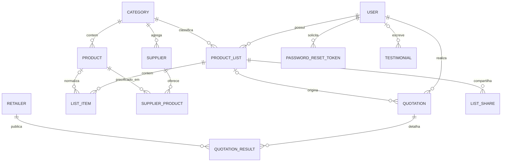

# Diagrama Entidade-Relacionamento

O resultado de paridade (`parityGroups`, `parityMeta` e `bestGroupId`) é armazenado na cotação como snapshot JSON para preservar o histórico mesmo que preços ou catálogo mudem.
